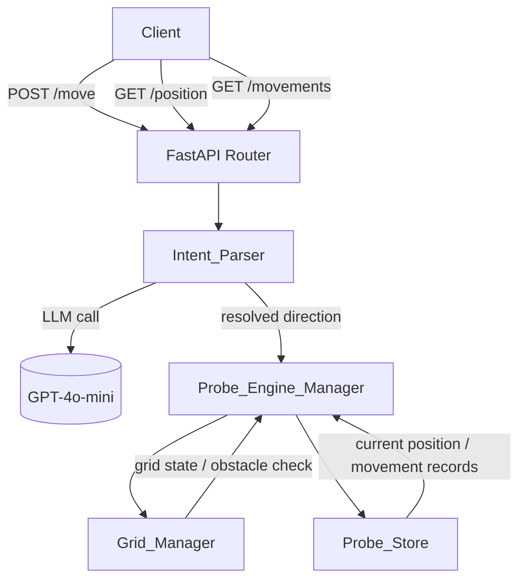

# Design Document: Probe_API

## Overview

The Probe_API is a Python microservice built with FastAPI that exposes an HTTP interface for steering a virtual probe around a 20×20 grid. Movement instructions are expressed as free-text natural language; a dedicated Intent_Parser component calls a lightweight LLM (GPT-4o-mini) to resolve the text to one of four canonical directions before handing off to the movement engine.

Key design goals:
- Clean separation between parsing, movement logic, grid state, and persistence
- Stateless HTTP layer backed by an in-memory store (simple, no external dependencies)
- LLM integration isolated behind a single interface so it can be swapped or mocked in tests

---

## Architecture



### Component Responsibilities

| Component | Responsibility |
|---|---|
| `Grid_Manager` | Owns the 20×20 grid definition and obstacle positions; answers "is this cell valid?" |
| `Intent_Parser` | Calls the LLM, parses the response, returns a direction or signals ambiguity/invalid input |
| `Probe_Engine_Manager` | Orchestrates a move: calls Intent_Parser → validates with Grid_Manager → persists via Probe_Store |
| `Probe_Store` | In-memory persistence for current probe position and movement history |
| `API (FastAPI router)` | Thin HTTP layer; maps requests to Probe_Engine_Manager calls and serialises responses |

---

## API Endpoint Definitions

### POST /move

Accepts a natural-language movement instruction and attempts to move the probe.

**Request body**
```json
{ "instruction": "go north" }
```

**Responses**

| Status | Condition | Body |
|---|---|---|
| 200 OK | Successful move | `{ "position": {"x": 0, "y": 1}, "message": "Moved up" }` |
| 200 OK | Ambiguous instruction | `{ "message": "I couldn't determine a direction. Could you rephrase?" }` |
| 422 Unprocessable Entity | Not a movement instruction | `{ "detail": "Input is not a movement instruction." }` |
| 422 Unprocessable Entity | Move blocked (obstacle / boundary) | `{ "detail": "Cannot move up: obstacle at (0,1)" }` |

### GET /position

Returns the probe's current position.

**Response (200 OK)**
```json
{ "x": 0, "y": 0 }
```

### GET /movements

Returns the full movement history sorted by date ascending.

**Response (200 OK)**
```json
[
  {
    "date": "2024-01-01T12:00:00Z",
    "from_position": {"x": 0, "y": 0},
    "direction": "up",
    "to_position": {"x": 0, "y": 1},
    "status": "success"
  }
]
```

---

## Components and Interfaces

### Grid_Manager

```python
class GridManager:
    GRID_SIZE: int = 20
    OBSTACLES: frozenset[tuple[int, int]] = frozenset({(2, 3), (9, 11)})

    def is_within_bounds(self, x: int, y: int) -> bool: ...
    def is_obstacle(self, x: int, y: int) -> bool: ...
    def is_cell_valid(self, x: int, y: int) -> bool: ...  # within bounds AND not obstacle
```

Stateless singleton — no mutable state, just grid rules.

### Intent_Parser

```python
class ParseResult:
    direction: Literal["up", "down", "left", "right"] | None
    is_ambiguous: bool
    is_invalid: bool
    clarification_message: str | None

class IntentParser:
    def parse(self, instruction: str) -> ParseResult: ...
```

The LLM is called with a structured prompt (see LLM Integration section). The response is parsed to extract one of the four canonical directions or a signal for ambiguity/invalid input.

### Probe_Engine_Manager

```python
class ProbeEngineManager:
    def __init__(self, grid_manager: GridManager, intent_parser: IntentParser, probe_store: ProbeStore): ...

    def move(self, instruction: str) -> MoveResponse: ...
    def get_position(self) -> Position: ...
    def get_movements(self) -> list[MovementRecord]: ...
```

Orchestration flow for `move()`:
1. Call `intent_parser.parse(instruction)`
2. If invalid → raise 422
3. If ambiguous → return 200 with clarification message
4. Compute candidate position from current position + direction delta
5. Call `grid_manager.is_cell_valid(candidate)` → if blocked → record failed attempt, raise 422
6. Update position in `probe_store`, append `MovementRecord`

### Probe_Store

```python
class ProbeStore:
    def get_position(self) -> Position: ...
    def set_position(self, position: Position) -> None: ...
    def append_movement(self, record: MovementRecord) -> None: ...
    def get_movements(self) -> list[MovementRecord]: ...
    def reset(self) -> None: ...  # used in tests
```

**Storage decision: in-memory**

The requirements specify no persistence across restarts and no multi-instance deployment. An in-memory store keeps the implementation simple, removes external dependencies, and makes testing straightforward. If persistence across restarts is needed later, the `ProbeStore` interface can be re-implemented against SQLite or another backend without touching the rest of the codebase.

---

## Data Models

```python
from pydantic import BaseModel
from datetime import datetime
from typing import Literal

class Position(BaseModel):
    x: int
    y: int

class MovementRecord(BaseModel):
    date: datetime
    from_position: Position
    direction: Literal["up", "down", "left", "right"]
    to_position: Position
    status: str  # "success" | descriptive failure reason

class MoveRequest(BaseModel):
    instruction: str

class MoveResponse(BaseModel):
    position: Position | None = None
    message: str
```

Direction → position delta mapping:

| Direction | Δx | Δy |
|---|---|---|
| up | 0 | +1 |
| down | 0 | -1 |
| left | -1 | 0 |
| right | +1 | 0 |

Grid coordinate convention: `(0,0)` is bottom-left; `x` increases rightward, `y` increases upward.

---

## LLM Integration (Intent_Parser)

### Model choice

GPT-4o-mini via the OpenAI Python SDK. It is fast, cheap, and sufficient for simple intent classification.

### Prompt design

A system prompt constrains the model to output only a structured JSON response:

```
System:
You are a movement intent classifier. Given a user instruction, respond with a JSON object:
  { "direction": "up" | "down" | "left" | "right" | null, "ambiguous": true | false }

Rules:
- If the instruction clearly maps to one direction, set direction to that value and ambiguous to false.
- If the instruction is a movement instruction but the direction is unclear, set direction to null and ambiguous to true.
- If the instruction is not a movement instruction at all, set direction to null and ambiguous to false.
- Synonyms: north/up, south/down, west/left, east/right, forward/up, back/down.
- Respond ONLY with the JSON object, no other text.

User: {instruction}
```

### Response parsing

The raw LLM response is parsed with `json.loads`. If parsing fails or the schema is unexpected, the parser treats the result as ambiguous to avoid crashing.

### Ambiguity vs invalid distinction

| LLM output | `direction` | `ambiguous` | Outcome |
|---|---|---|---|
| `{"direction": "up", "ambiguous": false}` | "up" | false | Move attempted |
| `{"direction": null, "ambiguous": true}` | null | true | 200 + clarification |
| `{"direction": null, "ambiguous": false}` | null | false | 422 invalid |
| Parse error / unexpected schema | — | — | treated as ambiguous |

---

## Project File Structure

```
probe_api/
├── main.py                  # FastAPI app entry point
├── routers/
│   └── probe.py             # API route handlers
├── components/
│   ├── grid_manager.py      # GridManager
│   ├── intent_parser.py     # IntentParser + ParseResult
│   ├── probe_engine_manager.py  # ProbeEngineManager
│   └── probe_store.py       # ProbeStore
├── models/
│   └── schemas.py           # Pydantic models (Position, MovementRecord, etc.)
└── tests/
    ├── test_grid_manager.py
    ├── test_intent_parser.py
    ├── test_probe_engine_manager.py
    ├── test_probe_store.py
    └── test_api.py
requirements.txt
```

---

## Correctness Properties

*A property is a characteristic or behavior that should hold true across all valid executions of a system — essentially, a formal statement about what the system should do. Properties serve as the bridge between human-readable specifications and machine-verifiable correctness guarantees.*

### Property 1: Grid bounds are exactly 20×20

*For any* integer coordinates `(x, y)`, `GridManager.is_within_bounds(x, y)` returns `True` if and only if `0 <= x < 20` and `0 <= y < 20`.

**Validates: Requirements 0.1**

---

### Property 2: Intent_Parser output is always one of the four canonical directions (or a signal)

*For any* mocked LLM response that contains a valid direction string, `IntentParser.parse()` returns a `ParseResult` whose `direction` field is exactly one of `{"up", "down", "left", "right"}` and whose `is_ambiguous` and `is_invalid` flags are both `False`.

**Validates: Requirements 1.1**

---

### Property 3: Ambiguous input returns 200 with clarification

*For any* instruction for which the `IntentParser` signals ambiguity (`is_ambiguous=True`), the `POST /move` endpoint returns HTTP 200 and a response body containing a non-empty `message` field.

**Validates: Requirements 1.3**

---

### Property 4: Invalid (non-movement) input returns 422

*For any* instruction for which the `IntentParser` signals an invalid (non-movement) input (`is_invalid=True`), the `POST /move` endpoint returns HTTP 422.

**Validates: Requirements 1.4**

---

### Property 5: Valid move round-trip — position is updated correctly

*For any* probe position `(x, y)` and direction `d` such that the resulting cell is within bounds and not an obstacle, calling `ProbeEngineManager.move()` with that direction and then `get_position()` returns the position `(x + Δx, y + Δy)` corresponding to direction `d`.

This consolidates the "position is updated" (2.1) and "get_position returns current coordinates" (4.1) requirements into a single round-trip property.

**Validates: Requirements 2.1, 4.1**

---

### Property 6: Blocked move returns 422

*For any* probe position `(x, y)` and direction `d` such that the resulting cell is either outside the grid or contains an obstacle, calling `POST /move` returns HTTP 422 and the probe position remains unchanged.

**Validates: Requirements 2.2**

---

### Property 7: Every movement attempt produces a Movement_Record

*For any* sequence of `n` move requests (valid or invalid, ambiguous or blocked), the list returned by `GET /movements` contains exactly `n` records — one per attempt.

**Validates: Requirements 2.3**

---

### Property 8: Movement history is sorted by date ascending

*For any* sequence of movement attempts, the list returned by `GET /movements` is sorted in non-decreasing order of the `date` field.

**Validates: Requirements 3.1**

---

## Error Handling

| Scenario | HTTP Status | Detail |
|---|---|---|
| Ambiguous natural language input | 200 OK | Clarification message in `message` field |
| Non-movement natural language input | 422 Unprocessable Entity | "Input is not a movement instruction." |
| Move would hit an obstacle | 422 Unprocessable Entity | "Cannot move {direction}: obstacle at ({x},{y})" |
| Move would go out of bounds | 422 Unprocessable Entity | "Cannot move {direction}: position ({x},{y}) is out of bounds" |
| LLM API call fails / timeout | 503 Service Unavailable | "Intent parsing service unavailable. Please try again." |
| LLM returns unparseable response | 200 OK | Treated as ambiguous; clarification message returned |
| Missing `instruction` field in request | 422 Unprocessable Entity | FastAPI automatic validation error |

All errors from the LLM layer are caught inside `IntentParser.parse()` and converted to either an ambiguous result (recoverable) or re-raised as a service-unavailable exception (unrecoverable).

---

## Testing Strategy

### Dual testing approach

Both unit/example tests and property-based tests are required. They are complementary:
- Unit tests verify specific examples, edge cases, and integration points
- Property tests verify universal invariants across many generated inputs

### Property-based testing library

Use **Hypothesis** (`pip install hypothesis`) — the standard Python PBT library. Each property test runs a minimum of 100 iterations (Hypothesis default is 100; set `@settings(max_examples=100)` explicitly).

Each property test must be tagged with a comment referencing the design property:
```
# Feature: Probe_API, Property {N}: {property_text}
```

### Unit tests (pytest)

| Test file | What it covers |
|---|---|
| `test_grid_manager.py` | Obstacle placement (0.2), boundary edge cases, `is_cell_valid` combinations |
| `test_intent_parser.py` | Mocked LLM responses for each direction, ambiguous/invalid signals, JSON parse error handling |
| `test_probe_store.py` | Initial position (0.3), append/retrieve movement records, reset |
| `test_probe_engine_manager.py` | Orchestration: valid move, blocked move, ambiguous, invalid — with mocked parser and grid |
| `test_api.py` | HTTP layer: all three endpoints, correct status codes, response schemas |

### Property tests (Hypothesis)

Each correctness property from the design maps to exactly one Hypothesis test:

| Property | Test description |
|---|---|
| Property 1 | Generate random `(x, y)` integers; assert `is_within_bounds` iff both in `[0, 20)` |
| Property 2 | Generate random direction strings from the four valid values; mock LLM; assert parser returns that direction |
| Property 3 | Mock parser as ambiguous; generate random instruction strings; assert POST /move → 200 with message |
| Property 4 | Mock parser as invalid; generate random instruction strings; assert POST /move → 422 |
| Property 5 | Generate random valid `(position, direction)` pairs; move; assert get_position equals expected delta |
| Property 6 | Generate random `(position, direction)` pairs that land on obstacle or out of bounds; assert 422 and position unchanged |
| Property 7 | Generate random sequences of move requests; assert len(GET /movements) == len(requests) |
| Property 8 | Generate random sequences of move requests; assert GET /movements dates are non-decreasing |

### Coverage target

Run with `pytest --cov=probe_api --cov-report=term-missing`. Target: 100% line coverage. The `IntentParser` LLM call is always mocked in tests; a separate integration test (marked `@pytest.mark.integration`) can be run manually with a real API key.
